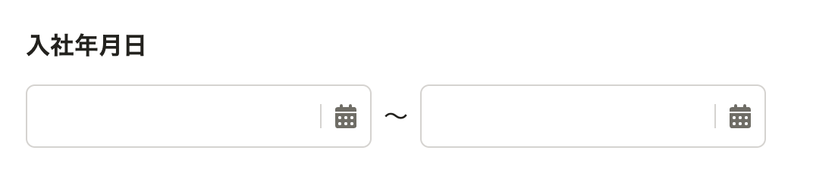
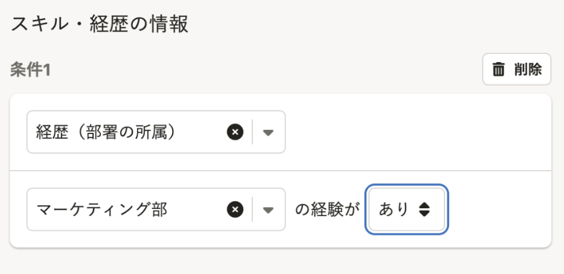

# すべてのinputに可視ラベルをつけたい
フロントエンドカンファレンス北海道2025 LT
株式会社SmartHR　maiha([@mt_dew2](https://x.com/mt_dew2))

---

- 今日はウェブアプリケーションで使う**入力要素とラベル**に関する話をします。
- ラベルがない／つけるのに悩んだ例を紹介します。
- ラベルとセットで提供すべきアクセシブルネームについても説明します。

<!--
ユーザーがウェブで情報を入力するときに使う入力要素と、そのラベルについてお話します。
またSmartHRのプロダクトの中で実際に出会った、ラベルがないUI、つけるのが難しかったUIの紹介をします。
ラベルとセットで提供するアクセシブルネームについても触れていきたいと思います。
-->

---

## 入力要素とは

- ユーザーに情報を入力させるUIコンポーネントのこと。
- HTML要素では `input`, `select`, `textarea`, `button`

<div style="text-align: center; margin-top: 2em">

</div>

<!-- 
まず今日のキーワードについて前提共有をします。
まず、入力要素ですが、ユーザーに入力をさせるために使用するUIコンポーネントのことです。
HTML要素でいうとinput、select、textarea,buttonなどのことです。
-->

---

## ラベルとは？

- **視覚的に「何を入力するか」を示すもの**
- `input`, `select`, `textarea`では、ラベルを`label`でマークアップする
  - **ラベルと同じ内容がアクセシブルネームとして機械にも提供される**
<br>

```
<label for="name">氏名</label>
<input type="text" id="name" name="name"/>
```

<!--
そして2つめはラベルです。
ラベルは「入力要素に何を入力するか」を示すテキストです。
何を入力するかをユーザーに見た目的に提示するのがラベルですが
同じ情報をマシンリーダブルにするために、アクセシブルネームというのも設定する必要があります。入力要素ではlabel要素を使用することで
-->
---

## 私が見た！ラベルがないがちなUI

<!--
私が見た！ラベルがないがちなUIの第一位を発表します。ジャジャン
-->
---

### 第1位：selectをつかったプルダウンメニュー

- 表示内容・順序の切り替え、ページの移動などフォーム以外でも使われる
が、`select`は入力要素なのでラベルが必要
<div style="text-align: center; height:100%;">
  
</div>

<!--
第一位はSelect要素です。特にSelectを利用したプルダウンメニューでよく省略されています。
原因としてはデフォルトの選択肢が表示されていることで、この中にどんなアイテムがあるか　推測可能そうに見えるためだと考えられます。

ですが、Selectは入力要素なので、原則としてラベルが必要で、ラベルがないと「ラベルのない入力要素」として扱われることになります。
実際、これは何を選択するのSelectなのか、プルダウンを開くまでは特定しにくいですよね。
-->

---

<figcaption>ラベルをつけて改善</figcaption>
<figure>
  
</figure>
<!--
こちらのUIはすでに改善しておりまして、このような形で、ステータスで絞り込むためのSelectだよーということがわかるラベルを「依頼ステータス」というのをつけています。
-->

---

## まとめ1: 入力要素とラベル
- 入力要素には**ラベル**が必要（[3.3.2: ラベル又は説明](https://waic.jp/translations/WCAG21/Understanding/labels-or-instructions.html)）
- `label`などで、適切なマークアップをすれば、**アクセシブルネーム**としても提供される
  - `label`では`for` `id`による関連付けが漏れないように気をつける

  <!--
  では１つ目のまとめです。入力要素には原則としてラベルが必要です。これはアクセシビリティの基準WCAGでも定められています。
  そして、このラベルを提供するときlabel要素を使って適切に紐づけをすれば、同じ内容がaccessible nameとしても提供されます。つまりスクリーンリーダーなどにも伝わるようになります。便利ですね。そして次に
  -->

---

## ラベルがあるけどアクセシブルネームが漏れてしまうケース:sob:

---

### アクセシブルネーム漏れあるある: 分割されたinput :broken_heart:

電話番号や郵便番号など、複数のinputに分かれているケースがあるが`label`は複数の`input`と紐づけられない。

<div style="text-align: center; display: flex; align-items: center;">
  
</div>

- 見た目上は「何を入力すべきか」をラベルで伝えている
- 機械に伝えるにはアクセシブルネームが必要
  - 複数のinputがあると`label`と紐づけできない:sob:

<!--
ラベルをlabel要素をつかって提供していれば、その情報はスクリーンリーダーなどにも伝わるはずなのですが
inputが分割されている場合。
label要素は複数のinputに紐づけができないので、電話番号や郵便番号の入力欄がハイフン区切りで分割されているような場合では
少し工夫が必要になります。
-->

---

### 解決方法: 各inputに`aria-label`を設定する

<div style="text-align: center;">
  
</div>

💡見た目上のラベルと同じ文言をアクセシブルネームに含める必要がある（[2.5.3: ラベルを含む名前](https://waic.jp/translations/WCAG21/Understanding/label-in-name.html)）

<!--
inputを分割しなければ、このような悩みは発生しないのですが
どうしても分割が必要な場合は、aria-labelなどを使ってそれぞれのinputにaccessible nameを付与する必要があります。このとき見た目上のラベルがaccessible nameにも含まれるように設定してください。
-->

---

## まとめ(2): ラベルとアクセシブルネーム

- ラベルは1個でも、アクセシブルネームはinputごとに必要
- アクセシブルネームにはラベルテキストを含めよう（[2.5.3: ラベルを含む名前](https://waic.jp/translations/WCAG21/Understanding/label-in-name.html)）
- 分割inputには気をつけよう:sob:
  - アクセシブルネームが漏れやすい
  - アクセシブルネームを検討するコストがかかる

<!--では本日のまとめ2です
アクセシブルネームは各input事に必要なので、分割inpuのときは気をつけてください。あとラベルに入っているテキストを含めてくださいというのは、こちらもWCAGの達成基準にありますので、後ほど見てみてください。
分割のinputを使わなければ、この悩みは不要になります。。
-->

---

## おまけ: 最近ラベル・アクセシブルネームに悩んだ入力UI

LTの時間に収まらなかったので今日は飛ばします！
スライドには入っているので後で見てください♪
<a href="#skip">飛ばす</a>

---

### 最近よく見るもの1: 期間の入力



- 「入社年月日　開始日」「入社年月日　終了日」などのアクセシブルネームをつける
- 「〜」で期間を表すのは日本だけっぽい。（翻訳時に注意が必要）

<!-- 
そして、ちょっと番外編で最近SmartHRでよく見るUIを3つ紹介します。1つめが期間の入力です。波ダッシュで区切って期間の開始と終了を入力することを表しています。
ラベルは「入社年月日」となっていて、２つのinputには個別のラベルはついていません。この場合はaria-labelで開始日・終了日などのアクセシブルネームを提供します。
-->

---

### 最近よく見るもの2: 条件の入力（範囲）


- 「年齢　下限値」「年齢　上限値」などのアクセシブルネームをつける
- `aria-labelledby`を使って、ラベル＋input＋歳以上の3つを紐づけると「年齢◯歳以上」のように良い感じに読み上げられるかも（[参考: Labelling Controls](https://www.w3.org/WAI/tutorials/forms/labels/)）
- 「以上」「未満」などの表現は、他の言語への直訳に注意

<!--
こちらは範囲条件の入力UIです。
入力欄歳以上　入力欄歳未満という入力です。この場合はinputに「下限値」「上限値」などのAccessible Nameをつけることができます。
また、この入力ででてくる「以上・未満」などの言葉は、英語など他の言語では挿入すべき位置が数字の前だったり後だったりして、いろいろ考慮が必要になることにも注意してください。
-->

---

## 最近よく見るもの3: 条件の入力（条件文）



- 各項目に、あなたならどんなアクセシブルネームをつけますか？

<!--
そして最後に、文章型の条件入力です。
このUIの場合、条件1というテキストが全体のラベルの役割をしていそうですが、各入力欄にはどんなアクセシブルネームをつけるのがよいでしょうか？
このスクリーンショットの場合だと1つ目が条件の分類みたいなものなので「分類」、2つ目がマーケティング部とはいっているので「部署」3つ目が「あり」なので多分「有無」が固有の名前(アクセシブルネーム)かなーと思います。
これは今このスクショに値が入っているので、推測から個別のアクセシブルネームを考えてみましたが
値が空だったら、多分検討が難しかったと思います。
-->

---

<h2 id="skip"> 最後のまとめ</h2>

- フォーム要素には入力の目的を説明する**ラベル**をつけよう！
- `label`要素でラベルをつけて、アクセシブルネームも提供しよう！
- 分割はやめよう

---

## ご清聴ありがとうございました！！
### アクセシビリティエンジニア募集中です！！！！
- アクセシビリティ分野での取り組みにおいて、強い思いのある方
- 自ら提案し、チャレンジすることが好きな方
- 多様なステークホルダーと協働できる方
- アクセシビリティを「やさしさ」と捉えず、仕組みとして多くの人へ提供したい方

[アクセシビリティエンジニア（シニア） / 株式会社SmartHR](https://open.talentio.com/r/1/c/smarthr/pages/87404)


---

## リンク集
- ラベルの付け方の例: [Labeling Controls | Web Accessibility Initiative (WAI) | W3C](https://www.w3.org/WAI/tutorials/forms/labels/)
- ラベルか説明をつけてねというWCAG達成基準: [3.3.2: ラベル又は説明](https://waic.jp/translations/WCAG21/Understanding/labels-or-instructions.html)
- アクセシブルネームにはラベルを含めようというWCAG達成基準: [2.5.3: ラベルを含む名前 (name) ](https://waic.jp/translations/WCAG21/Understanding/label-in-name.html)
- SmartHRでは、Inputをラップするコンポーネントを提供してラベル漏れを防いでいます: [FormControl | コンポーネント | SmartHR Design System](https://smarthr.design/products/components/form-control/)
- メンバー募集中です: [アクセシビリティエンジニア（シニア） / 株式会社SmartHR](https://open.talentio.com/r/1/c/smarthr/pages/87404)
